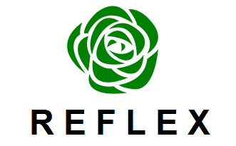

  

<a href="https://github.com/MrX456/reflex/issues/new"> Reportar um problema </a>

<h2>Tabela de conteúdo</h2>
<ul>
  
 <a href="https://github.com/MrX456/reflex/blob/master/README.md#sobre">Sobre o Reflex.</a> 

  
 <a href="https://github.com/MrX456/reflex/blob/master/README.md#download">Download.</a> 

  
 <a href="https://github.com/MrX456/reflex/blob/master/README.md#instalação">Instalação.</a> 

  
 <a href="https://github.com/MrX456/reflex/blob/master/README.md#tutorial">Tutorial.</a> 

  
 <a href="https://github.com/MrX456/reflex/blob/master/README.md#contribuição">Contribuição.</a> 

  
 <a href="https://github.com/MrX456/reflex/blob/master/README.md#criadores">Criadores.</a> 

  
  

  
 <a href="https://github.com/MrX456/reflex/blob/master/README.md#quantum-comp-it-solutions">Quantum Comp IT Solutions.</a> 

  
 <a href="https://github.com/MrX456/reflex/blob/master/README.md#copyright-e-licença">Copyright e Licença.</a> 

</ul>

<h2>Sobre</h2>

Reflex é um software onde você pode registrar suas metas pessoais, seus sentimentos, alegrias
ou mesmo desânimo. Através destes dados registrados
você poderá pensar melhor em como gerenciar sua
vida pessoal e melhorar sua qualidade de vida.
 

O Reflex também conta com um link direto para o site do CVV(Centro de Valorização da
Vida).

No Reflex seus dados ficam registrados em seu próprio computador e são
criptografados para melhor segurança, sinta-se a vontade para registrar o que quiser
sem preocupação, pois seu dados estão seguros. Varios usuários podem compartilhar
o uso do Reflex, porém cada usuário poderá ter acesso somente ao seus próprios
dados.

Caso esteja enfrentando dificuldades severas recomendamos procurar ajuda
de um profissional.

<h2>Download</h2>

Versão 1.0.0 -> <a href="https://github.com/MrX456/reflex/raw/master/Deployment/Reflex Installer.rar">reflex 1.0.0</a>

<h2>Instalação</h2>

Aqui vai as instruções de instalação do Reflex.

<h2>Tutorial</h2>

Se desejar acesse o canal da Quantum Comp para ver um tutorial de uso 
completo do Reflex.

aqui vai o link do tutorial no canal.

<h2>Contribuição</h2>

Você pode contribuir com o código fonte do Reflex.

O Reflex foi desenvolvido sob licença GPL3 que permite a alteração e
distribuição de seu código fonte.

Veja a documentação <a href="">aqui</a>

<h2>Criadores</h2>

Desenvolvido por : MrX456

Sob Licença GPL

Quantum Comp IT Solutions
<!--Colocar link do site quando estiver pronto-->

<h2>Colaboradores</h2>

 <a href="https://github.com/MrX456">MrX456</a> 

<h2>Quantum Comp IT Solutions</h2>

Siga a Quantum Comp nas redes sociais.</a>

<a href="https://www.facebook.com/quantumcomp.itsolutions/?">&nbsp Facebook</a>

<a href="https://twitter.com/quantumcompit">&nbsp Twitter</a>

<a href="https://www.instagram.com/quantumcompitsolutions/">&nbsp Instagram</a>

<a href="https://www.youtube.com/channel/UCW5kvY7x53LG1CZGtsoqdpw/featured">&nbsp Youtube</a>

<h2>Copyright e Licença</h2>

Copyright © Quantum Comp IT Solutions - All Rights Reserved - Code released under GPL3 License.

